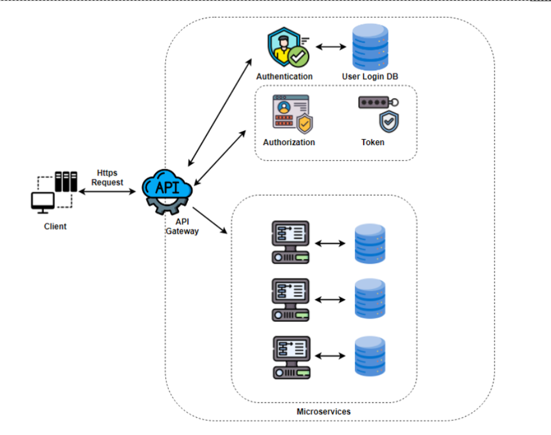
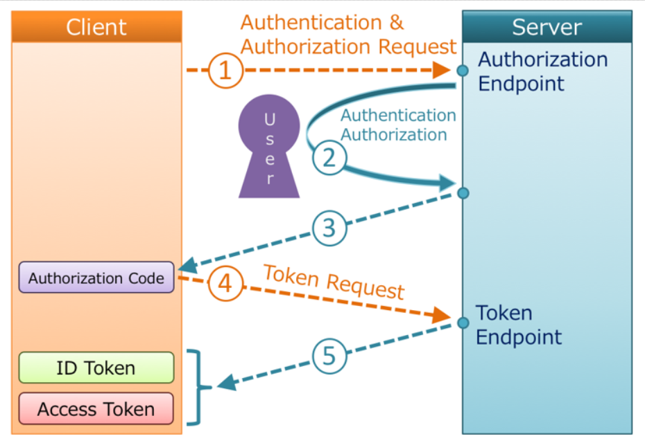
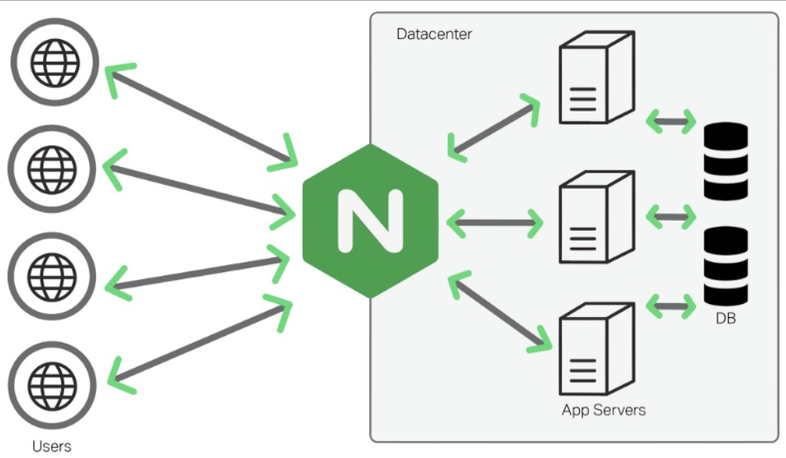

# SECURE API-BASED WEB APPLICATION FOR AUTHENTICATION WITH ACCESS TOKEN 

# Proposed scheme

# Authen-Author Data flow

# API-Gateway

# References
K. Das, P. Perumal and J. Bose, "Security Mechanism for Packaged Web Applications," 2017 IEEE International Conference on Web Services (ICWS), Honolulu, HI, USA, 2017, pp. 612-619, doi: 10.1109/ICWS.2017.72. "https://ieeexplore.ieee.org/document/8029814"

T. Saito, D. Miyata, T. Watanabe and Y. Nishikura, "Security Authorization Scheme for Web Applications," 2015 18th International Conference on Network-Based Information Systems, Taipei, Taiwan, 2015, pp. 250-256, doi: 10.1109/NBiS.2015.40. "https://ieeexplore.ieee.org/document/7350628"
